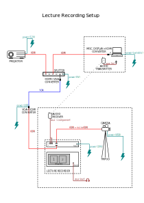

# GPSS 2018 : Labs and Resources
---

## Labs

### Notebooks
Notebooks and answers are in the [`lab` directory](./lab). Some changes from last year:

#### Lab 1: Gaussian Process Regression [link](./lab/GPSS%20Lab%201%20Answers.ipynb)
- Support for Python 3.5+ only
    - This is not essential, but notebooks require some adaptation to change
    - Uses Python 3 specific styling, and have made use of `@` for matrix multiplication, amongst others
- Updated examples
    - Changed real-world example from marathon data to Mauna Loa
        - Based on Rich's notebooks
        - Used primarily to demonstrate kernel choice and combinations of kernels
        - Removed the mean function stuff from Rich's examples
        - Motivation: recognisable case study, good examples of different trends, e.g. linear(ish) growth, periodicity, non-linear aspects, Gaussian likelihood
    - Given some more intuitive examples of summing / multiplying kernels
    - Shown how to sample kernels and given examples of different kinds samples before exercise on identifying kernels based on samples
    - Added explicit calculation of GP posterior using GP equations before introducing GPy as a tool
    - Added exercise showing how bad prediction is for extrapolation, and also briefly introduced the concept of incorporating known info into kernel choice (in this case, periodicity), before explicitly doing it in Mauna Loa example
    - Removed the section on Uncertainty propagation
        - Not clear of purpose, documentation lacking
        - Could be moved into a separate notebook as _extra work_
    - Added short 2-D example similar to Rich's
        - Shows using product of two kernels with different active dimensions
        - Shows using isotropic kernels
        - Needs a bit of polishing
- Removed all use of `m.plot()` and GPy's inbuilt plotting tools
    - Provided a transparent and _short_ function for plotting GP posterior given X, mean and covariance matrix
    - Show how to access these directly from model
    - Avoid using GPy plotting because:
        - Not clear what it's actually showing
        - Documentation bad
        - Hard to use in notebooks, no control over plot canvas
        - GPy is not a plotting library, generally not good practise to use it for plotting (imo)
        - Show how to get predictions, and parameters, so it's clear what is actually being plotted
- Rewritten a lot of text for clarity and correctness
    - Lots of incorrect code examples in text had been carried on over years, have confirmed correctness of everything now
- Exercises:
    1. Effects of parameters on (RBF) kernel
    1. Modelling with and validity of combined kernels
    1. Identify the covariance function
    1. Fitting a GP, changing parameters and sampling posterior
    1. Extrapolating with a GP, embedding prior knowledge for a better
    1. Fitting combinations of kernels to the Mauna Loa dataset
    1. Improving the fit

- Needs polishing and a bit of extra text

#### Lab 2 : Non-Gaussian likelihoods / classification
- @Fariba

#### Lab 3 : Bayesian optimisation
- @Mauricio

---
## Equipment

Setup information available as [pdf](recording_setup.pdf), [png](recording_setup.png), and [svg](recording_setup.svg)

### Description
The speaker should have a laptop plugged into an HDMI cable, and powered. Any conversion between display adaptors should be down so that the HDMI cable can be plugged in. Anyone with a non-UK power lead should use the provided conversion adaptor (apparently there's some legality issues here around using standard ones, but I've identified a multi-adaptor that should be fine). The speaker should also be fitted with the microphone and audio transmitter &ndash; this should be battery powered, rather than by mains, due to reported feedback in the audio receiver. The batteries should be changed in the transmitter after _every speaker_, and in the receiver _every day_.

The laptop display is connected via HDMI to the splitter, which needs to be independently powered. It needs to be plugged into the *middle* port, marked "HDMI-IN". One out should be plugged into the projector via HDMI **(I am presuming that an HDMI cable will be provided in the room to connect to the projector)**.

The second output from the splitter should be directly converted to VGA using the non-powered, short HDMI-VGI adaptor. On the other end of the VGA cable, there should be an gender change adaptor, and the _powered_ VGA-HDMI converter to convert back to HDMI. The adaptor is powered via a micro USB port. The reason for the HDMI-VGA-HDMI conversion is to strip the digital signal (by converting to analogue and back again) of any encryption that may prevent us from recording the screen. This is a confirmed issue on laptops running recent versions of macOS, and the VGA conversion is a successful work-around. Conceivably this could be done _before_ the splitter **(is there any known reason to do it a particular way ?, the limitation currently is that we lose sound output from the laptop in the recording, but can pass a digital signal to the projector)**.

The camera is powered by a USB fixed in the handle, with a 1 m extender available. The output from the camera is passed via microHDMI (inside the screen cover), for which we have a microHDMI to HDMI cable. The camera has no memory, and all recording is performed on the recording box, so **don't press record on the camera**. The audio receiver has an aux output which needs to be converted to R/W component. Both the camera output and audio should be plugged into _channel 1_, via HDMI/component respectively. There are two component adaptors provided in the lecture recorder. The output from the splitter should be plugged into _channel 2_ via HDMI. Headphones can be plugged into the front, for the operator to check the quality of audio in the recording.

### Inventory

| # | Item | Notes |
|---|------|-------|
| 1 | Video Camera | Sony HDR-CX240E, needs USB charger |
| 1 | Tripod | |
| 2 | Audio Transmitter / Receiver | Battery powered |
| 1 | Microphone (clip-on) | Aux (in) |
| 1 | Lecture Recorder | PAT done 26/07/18 |
| 1 | DC 19V Adaptor + lead | for recorder|
| 1 | 4-way HDMI splitter | split laptop signal between projector and recorder |
| 1 | DC 5V adaptor | for splitter |
| 6 | USB Flash Drives (2GB) | _need checking_ |
| 20| Batteries (AA) | Checked for charge |

| # | Cable | Lengths | Notes |
|---|-------|---------|-------|
| 2 | microHDMI `[M]` → HDMI `[M]` | 20 cm, 1 m | camera → recorder |
| 1 | USB-A `[F]` → USB-A `[M]` | 1 m | extends camera power cable|
| 2 | aux `[M]` → aux `[M]` | 30 cm, 1.5 m | non-essential |
| 1 | aux `[M]` → component `[M,M]` | 1.5 m | audio receiver → recorder |
| 3 | VGA `[M]` → VGA `[M]` | 1.5 m | used for analogue conversion in VGA/HDMI setup |
| 1 | microUSB `[M]` → USB-A `[M]` | 1 m | to power VGA/HDMI adaptor |
| 2 | HDMI `[M]` → HDMI `[M]` | 2 m, 10 m | laptop → splitter, splitter → recorder (via VGA) |
| 1 | HDMI `[F]` → HDMI `[M]` | 2 m | extender, non-essential|

| # | Adaptors | Notes |
|---|----------|-------|
| 1 | HDMI `[F]` → miniHDMI `[M]` | non-essential |
| 2 | HDMI `[F]` → microHDMI `[M]` | non-essential |
| 1 | HDMI `[M]` → VGA `[F]` | VGA/HDMI conversion |
| 1 | VGA `[F]` → VGA `[F]` | VGA/HDMI conversion |
| 1 | VGA `[M]` → HDMI/aux `[F,F]` | VGA/HDMI conversion, requires power, needs USB charger |

#### We need to get the following
| # | Item | Notes | Link |
|---|------|-------|------|
| 2 | USB power chargers | For camera and VGA/HDMI conversion | [amazon](https://www.amazon.co.uk/SOAIY-Charger-Plug-Adapter-Black/dp/B078RGYH8B/ref=sr_1_8?ie=UTF8&qid=1532685735&sr=8-8&keywords=usb%2Bpower%2Badaptor&th=1) |
| 1 | mini DisplayPort `[M]` → HDMI `[F]` adaptor | Laptop output adaptor | [amazon](https://www.amazon.co.uk/Rankie-DisplayPort-Thunderbolt-Adapter-Resolution-Black/dp/B010SDAXUK/ref=sr_1_4?ie=UTF8&qid=1532685268&sr=8-4&keywords=mini+displayport+to+hdmi) |
| 1 | DisplayPort `[M]` → HDMI `[F]` adaptor | Laptop output adaptor | [amazon](https://www.amazon.co.uk/Displayport-Adapter-Benfei-Display-Converter/dp/B017Q8ZVWK/ref=sr_1_3?ie=UTF8&qid=1532685285&sr=8-3&keywords=displayport+to+hdmi)| 
| 1 | USB-C `[M]` → HDMI `[F]` adaptor | Laptop output adaptor | [amazon](https://www.amazon.co.uk/HDMI-Adapter-60Hz-PRIME-SALE/dp/B075V68NVR/ref=sr_1_6?s=computers&ie=UTF8&qid=1532685388&sr=1-6&keywords=usb-c+to+hdmi) |
| 1 | DVI `[M]` → HDMI `[F]` adaptor | Laptop output adaptor | [amazon](https://www.amazon.co.uk/UGREEN-Adapter-Support-Raspberry-Projector/dp/B00B2HORS6/ref=sr_1_10?s=computers&ie=UTF8&qid=1532685441&sr=1-10&keywords=dvi+to+hdmi) | 
| 1 | Power passport | If speaker does not have UK plug | [amazon](https://www.amazon.co.uk/Worldwide-Adapter-BEZ-International-Charging-Black/dp/B01J18QF6E/ref=sr_1_4?ie=UTF8&qid=1532685558&sr=8-4&keywords=power+adaptor) | 
| 1 | Headphones | To check recording audio is working | [amazon](https://www.amazon.co.uk/Betron-Headphones-Earphones-Smartphones-Microphone-Black/dp/B00P89DXYI/ref=sr_1_3?ie=UTF8&qid=1532685599&sr=8-3&keywords=headphones) |
| 1 | Laser Pointer | For speakers if necessary | [amazon](https://www.amazon.co.uk/Rechargeable-Presentation-Presenter-Compatible-Android-black-black/dp/B072X8KQ1P/ref=sr_1_7?s=electronics&ie=UTF8&qid=1532685627&sr=1-7&keywords=laser+pointer) |
| 12 | Assorted Marker Pens | | [amazon](https://www.amazon.co.uk/STAEDTLER-351WP6-Lumocolour-Whiteboard-Multicolor/dp/B000KJMJ5K/ref=sr_1_3?ie=UTF8&qid=1532685661&sr=8-3&keywords=board%2Bmarkers&th=1) |
| 1 | Multiline power adaptor | For recording setup, can try and get from support | |

---

## Misc.

### Orders

**todo**:
- T-shirts
    - clothes2order
    - Account: my email
    - Fitted / Straight cut
- Stationary
    - Pads of paper
        - Looking into better bound options
    - Lanyards / name badge holders
    - Marker pens
    - Pens / pencil
        - branded ?
